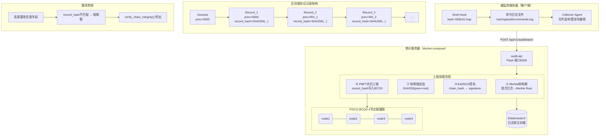
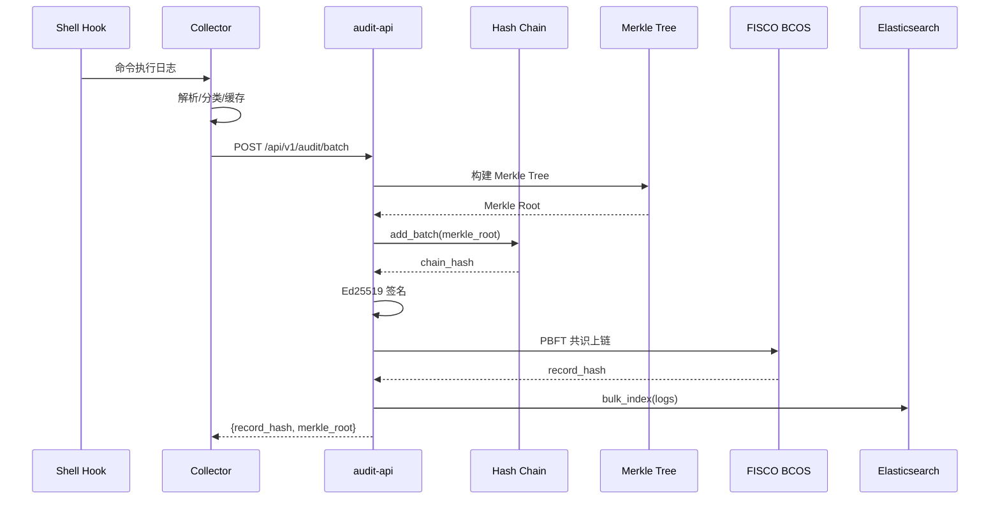

# 基于联盟链的服务器操作审计系统

利用联盟链不可篡改特性，将服务器操作行为的关键证据（Merkle Root + Ed25519 签名）锚定到链上，形成从"命令执行"到"审计验证"的完整可信证据链。

## 系统作用

服务器是企业的核心资产。管理员在服务器上执行的所有命令（包括误操作和恶意操作）都应当被记录、存证、可审计。本系统：

1. **采集**：监听服务器 Shell 命令执行，实时捕获操作日志
2. **存证**：日志批次 → Merkle 树聚合 → 哈希链链接 → Ed25519 签名 → 上链
3. **验证**：任何人均可独立验证日志真伪：重算 Merkle Root，比对链上哈希
4. **告警**：高危命令实时邮件告警，中危命令缓冲批量告警
5. **回放**：按时间轴回放任意操作者的完整操作序列
6. **报告**：一键生成 Markdown 审计报告（含风险分布、操作者统计、高危清单）

## 支持的操作系统

| 操作系统 | Demo 模式 | Docker 部署 |
|---------|----------|------------|
| Linux (Ubuntu/Debian/CentOS) | ✅ | ✅ |
| macOS | ✅ | ✅ |
| Windows | ✅ | ✅（Docker Desktop） |

## 系统架构



### 数据流



## 快速开始

### 1. 演示模式（MockBCOS 区块链模拟 | 零容器，秒启动）

模拟整个区块链系统在单机运行，用于功能演示和开发调试。无需 Docker，无需真实节点。

```bash
pip install -r requirements.txt

# 一键端到端演示（3 批次上链 + PBFT 共识 + 拜占庭攻击检测）
make demo

# 或手动启动 API + Web 仪表板
make run-api
# 浏览器打开 http://localhost:5000

# 查看 CLI 工具
python -m src.cli.audit_cli chain-info
python -m src.cli.audit_cli search --operator zhangsan
python -m src.cli.audit_cli verify --log-id <日志ID>
python -m src.cli.audit_cli report
```

---

### 2. 服务端部署（FISCO BCOS 节点 + API）

部署到服务器，作为联盟链节点运行，接收客户端采集的日志并上链存证。

#### 方式 A：Docker 完整部署

```bash
# 启动 BCOS 4 节点 + ES + API（共 6 容器）
docker-compose up -d

# 查看日志
docker-compose logs -f

# 部署 Solidity 合约（首次需要）
docker exec audit-api python scripts/deploy_contract.py
```

#### 方式 B：裸机部署

```bash
pip install -r requirements.txt

# 启动 API 服务（production 模式，自动连本地 BCOS）
AUDIT_SYSTEM_MODE=production_sim \
BCOS_ENDPOINT=127.0.0.1:20200 \
ES_HOST=localhost:9200 \
FLASK_APP=src.api.routes \
python -m flask run --host 0.0.0.0 --port 5000
```

---

### 3. 被监控客户端部署

在被审计的每台服务器上运行采集代理，将命令日志推送到服务端。

```bash
# 安装 Shell Hook（bash DEBUG trap，捕获所有执行命令）
sudo bash scripts/install-audit-hook.sh

# 启动采集器，监听日志文件并推送至服务器
python -m src.collector.agent \
    --mode direct \
    --log-file /var/log/audit/commands.log \
    --api-url http://服务器IP:5000/api/v1/audit/batch \
    --batch-secs 60

# 堡垒机模式（等待堡垒机推送日志）
python -m src.collector.agent \
    --mode bastion \
    --listen-port 5001 \
    --api-url http://服务器IP:5000/api/v1/audit/batch

# 验证日志已上传
curl http://服务器IP:5000/api/v1/audit/search?size=10
```

---

### 4. 生产环境模拟（Docker 本地测试）

在本机用 Docker 启动完整的 FISCO BCOS 联盟链 + API + ES，模拟真实生产环境。

```bash
# 启动全部 6 个容器（4 BCOS 节点 + ES + API）
docker-compose up -d

# BCOS 区块链网络正常运行
# API 运行在 http://localhost:5000

# 在宿主机上启动采集器模拟客户端
python -m src.collector.agent --mode demo --api-url http://localhost:5000/api/v1/audit/batch

# 访问仪表板
open http://localhost:5000
```

---

### 测试验证

```bash
# 运行全部 157 个测试
make test

# 含覆盖率报告
make test-coverage
```

## 已实现功能

| 模块 | 功能 | 状态 |
|------|------|:--:|
| **采集层** | 日志文件实时监听（tail 模式 + 日志轮转检测） | ✅ |
| | 堡垒机 HTTP 日志接收（单条 / 批量 JSON） | ✅ |
| | Shell Hook 命令捕获（bash DEBUG trap） | ✅ |
| | 4 种日志格式自动识别（raw / syslog / bastion / auto） | ✅ |
| | 命令风险等级自动判定（高危 / 中危 / 正常） | ✅ |
| **存证层** | Merkle 树构建 + 存在性证明 | ✅ |
| | SHA-256 跨批次哈希链（链表结构） | ✅ |
| | Ed25519 数字签名 + 验签 | ✅ |
| | 自适应批处理（根据流量动态调整 300/50/10 阈值） | ✅ |
| **区块链** | MockBCOS 合约模拟（Demo 模式零依赖） | ✅ |
| | MockConsensusNetwork PBFT 共识（Pre-Prepare→Prepare→Commit） | ✅ |
| | 拜占庭节点模拟 + 跨节点账本验证 | ✅ |
| | FISCO BCOS 真实合约（生产模式） | ✅ |
| | 链完整性验证（逐条验证 prev_hash + record_hash） | ✅ |
| **API** | POST /api/v1/audit/batch（日志批次上链） | ✅ |
| | GET /api/v1/audit/search（日志搜索） | ✅ |
| | POST /api/v1/audit/verify（单条验证） | ✅ |
| | GET /api/v1/audit/chain/integrity（链完整性） | ✅ |
| | GET /api/v1/audit/chain/consensus（PBFT 共识状态） | ✅ |
| | GET /api/v1/audit/chain/cross-verify（跨节点验证） | ✅ |
| | POST /api/v1/audit/chain/attack（拜占庭攻击模拟） | ✅ |
| **告警** | 高危命令即时邮件告警 | ✅ |
| | 中危命令缓冲批量告警（5条或10分钟超时） | ✅ |
| | SMTP 未配时静默跳过 | ✅ |
| **回放** | 操作时间轴输出（文本 / HTML） | ✅ |
| | 会话自动拆分（30 分钟空闲断开） | ✅ |
| **报告** | Markdown 审计报告生成 | ✅ |
| | 操作者行为统计 + 风险分布 + 高危清单 | ✅ |
| **Web** | 仪表板单页应用（5 功能页签） | ✅ |
| | 日志验证页面 | ✅ |
| **部署** | Docker / Docker Compose 一键部署 | ✅ |
| | 服务器 + 客户端分离部署 | ✅ |
| **测试** | 157 个单元 / 集成测试 | ✅ |
| | 端到端验证脚本（e2e_demo.py） | ✅ |

## 系统模块

| 模块 | 文件 | 说明 |
|------|------|------|
| 配置 | `src/config.py` | 系统模式（demo/production_sim/production）、环境变量 |
| 加密 | `src/crypto/key_manager.py` | Ed25519 密钥生成、PEM 存储、指纹计算 |
| | `src/crypto/signer.py` | Ed25519 签名 / 验签 |
| Merkle | `src/merkle/tree.py` | Merkle 树构建、Root 计算 |
| | `src/merkle/proof.py` | Merkle 证明生成 / 验证 |
| 哈希链 | `src/chain/hash_chain.py` | 跨批次 SHA-256 链式存证、完整性验证 |
| 区块链 | `src/debug/mock_bcos.py` | MockBCOS + PBFT 共识网络 + 拜占庭模拟 |
| | `src/ledger/bcos_client.py` | FISCO BCOS SDK / JSON-RPC 客户端 |
| | `src/ledger/contract.py` | 合约调用封装 |
| | `bcos/contract/audit_ledger.py` | Python 合约 + ABI 定义 |
| 存储 | `src/debug/mock_es.py` | SQLite 模拟 Elasticsearch |
| | `src/storage/es_client.py` | Elasticsearch 客户端 |
| | `src/storage/query.py` | 链下查询与单条日志验证 |
| 采集 | `src/collector/agent.py` | 采集代理主调度器 |
| | `src/collector/watcher.py` | 日志文件监听（tail 模式） |
| | `src/collector/receiver.py` | 堡垒机 HTTP 接收器 |
| | `src/collector/parser.py` | 4 种日志格式解析 + 风险判定 |
| | `src/collector/forwarder.py` | HTTP 转发器（自适应批处理） |
| | `src/collector/config.py` | 采集层配置 |
| API | `src/api/routes.py` | Flask 路由（8 个端点 + 2 Web 页面） |
| CLI | `src/cli/audit_cli.py` | 命令行工具（search/verify/chain/replay/report） |
| 告警 | `src/alert/engine.py` | 告警引擎（高危即时 + 中危缓冲） |
| | `src/alert/notifier.py` | SMTP 邮件通知器 |
| | `src/alert/config.py` | 告警配置 |
| 回放 | `src/replay/engine.py` | 操作回放引擎（时间轴 + 会话拆分） |
| 报告 | `src/report/generator.py` | Markdown 审计报告生成器 |
| 测试 | `src/debug/data_generator.py` | 模拟操作日志生成器 |
| Shell | `scripts/install-audit-hook.sh` | Shell Hook 安装脚本 |
| | `scripts/e2e_demo.py` | 端到端验证脚本 |
